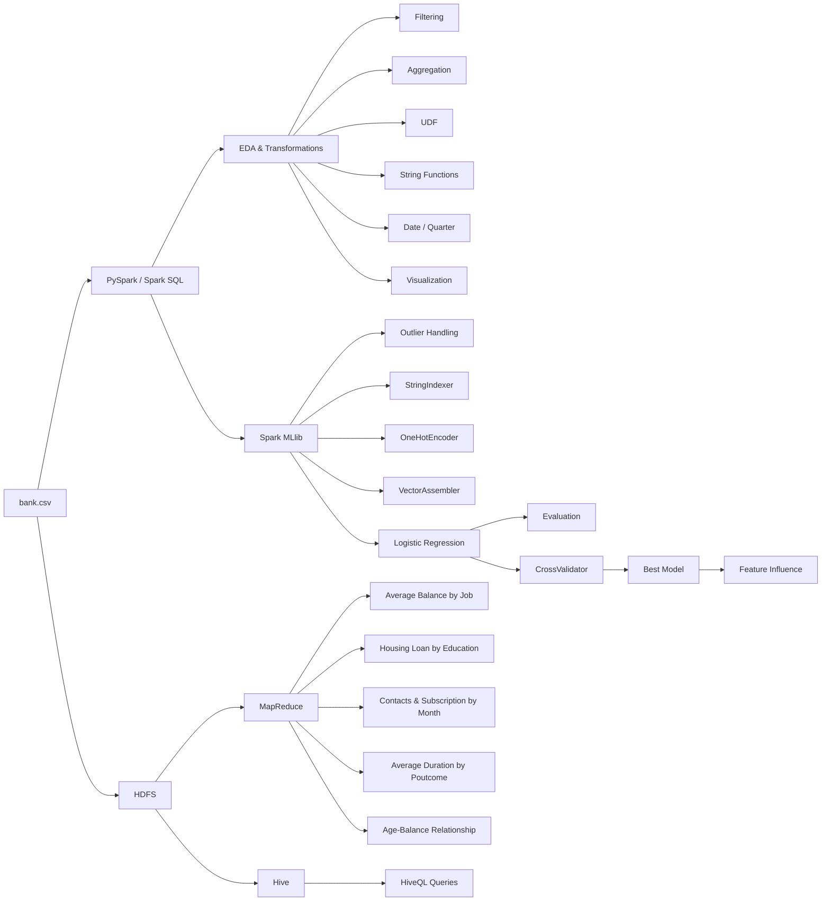

# 🏦 Distributed Machine Learning & Big Data Analytics for Banking

<p align="center">
  <b>End-to-end banking analytics using Apache Spark, Hadoop, HDFS, Hive, MapReduce and Spark MLlib</b>
</p>

<p align="center">
  
  
  
  
  
  
  
</p>

---

## 📌 Table of Contents

- [Overview](#-overview)
- [Project Objectives](#-project-objectives)
- [System Architecture](#-system-architecture)
- [Dataset](#-dataset)
- [Technology Stack](#-technology-stack)
- [1. Spark Exploratory Data Analysis](#1--spark-exploratory-data-analysis)
- [2. Hadoop HDFS & MapReduce](#2--hadoop-hdfs--mapreduce)
- [3. Hive Data Warehouse Layer](#3--hive-data-warehouse-layer)
- [4. Predictive Modeling with Spark MLlib](#4--predictive-modeling-with-spark-mllib)
- [5. Hyperparameter Tuning](#5--hyperparameter-tuning)
- [6. Distributed / Parallel Machine Learning](#6--distributed--parallel-machine-learning)
- [Results](#-results)
- [Project Structure](#-project-structure)
- [Setup](#-setup)
- [How to Run](#-how-to-run)
- [Key Insights](#-key-insights)
- [Limitations](#-limitations)
- [Future Improvements](#-future-improvements)
- [Author](#-author)

---

## 🚀 Overview

This project is a **Distributed Machine Learning and Big Data Analytics capstone for banking data**.

The notebook works with a `bank.csv` dataset and demonstrates how the same business data can be processed through multiple big-data technologies:

```text
Raw Banking Data
      │
      ├──────────────► Apache Spark / PySpark
      │                    │
      │                    ├── EDA
      │                    ├── Transformations
      │                    ├── Aggregations
      │                    └── Visualization
      │
      ├──────────────► HDFS
      │                    │
      │                    └── Distributed Storage
      │
      ├──────────────► MapReduce
      │                    │
      │                    └── Distributed Batch Analytics
      │
      ├──────────────► Hive
      │                    │
      │                    └── SQL / Warehouse Queries
      │
      └──────────────► Spark MLlib
                           │
                           ├── Preprocessing
                           ├── Logistic Regression
                           ├── Evaluation
                           └── Cross-Validation
```

The predictive modeling objective is to determine whether a banking client will subscribe to a **term deposit**, using the target variable:

```text
y
```

---

## 🎯 Project Objectives

### Big Data Analytics
- Load and inspect banking data with Spark.
- Perform filtering, grouping, aggregation and joins.
- Apply Spark UDFs.
- Perform string and date-related transformations.
- Convert Spark output to Pandas for visualization.

### Hadoop & Distributed Processing
- Store the dataset in HDFS.
- Implement MapReduce jobs with `mrjob`.
- Analyze banking information through distributed batch processing.

### Hive
- Create a Hive database.
- Create an external Hive table.
- Load HDFS data into Hive.
- Run HiveQL analytical queries.

### Machine Learning
- Handle missing values.
- Detect and cap numerical outliers using IQR.
- Encode categorical variables.
- Assemble ML features with Spark MLlib.
- Train a Logistic Regression classifier.
- Evaluate the model with AUC, Accuracy, Precision, Recall and F1-score.
- Tune hyperparameters with `ParamGridBuilder` and `CrossValidator`.
- Inspect Logistic Regression feature coefficients.

### Distributed ML
- Train Spark MLlib models using distributed execution.
- Discuss partitioning, memory management, shuffle and Spark task scheduling.
- Demonstrate Spark's lazy evaluation and Catalyst optimization concepts.

---

# 🏗️ System Architecture



> GitHub renders Mermaid diagrams directly inside Markdown, so the architecture is interactive and viewable without opening another file.

---

# 📊 Dataset

The project uses the **bank marketing dataset** stored as:

```text
bank.csv
```

The Spark schema contains **17 columns**:

| Column | Description |
|---|---|
| `age` | Client age |
| `job` | Job category |
| `marital` | Marital status |
| `education` | Education level |
| `default` | Credit default status |
| `balance` | Account balance |
| `housing` | Housing loan status |
| `loan` | Personal loan status |
| `contact` | Contact communication type |
| `day` | Last contact day |
| `month` | Last contact month |
| `duration` | Contact duration |
| `campaign` | Number of contacts during the campaign |
| `pdays` | Days since previous contact |
| `previous` | Number of previous contacts |
| `poutcome` | Previous campaign outcome |
| `y` | Term-deposit subscription target |

The notebook reports:

```text
Rows: 4,521
Columns: 17
```

---

# 🧰 Technology Stack

| Layer | Technology |
|---|---|
| Programming | Python |
| Distributed Processing | Apache Spark / PySpark |
| Distributed Storage | Hadoop HDFS |
| Batch Processing | MapReduce / `mrjob` |
| SQL Warehouse | Apache Hive |
| Machine Learning | Spark MLlib |
| Visualization | Pandas, Matplotlib, Seaborn |
| Notebook | Google Colab |

---

# 1. 🔎 Spark Exploratory Data Analysis

The first part of the project performs exploratory analysis using PySpark.

## Spark Initialization

The notebook:

- Installs PySpark.
- Creates a `SparkSession`.
- Loads `bank.csv` using Spark.

Example:

```python
from pyspark.sql import SparkSession

spark = SparkSession.builder \
    .appName("BankAnalysis") \
    .getOrCreate()
```

---

## Data Inspection

The notebook performs:

```python
spark_df.show(5)
spark_df.printSchema()
spark_df.describe().show()
```

This establishes:

- Data structure
- Column types
- Numerical summaries
- Dataset size

---

## Filtering

Clients with:

```text
balance > 1000
```

are filtered using Spark DataFrame operations.

---

## Month & Quarter Transformation

The `month` field contains string abbreviations such as:

```text
jan
feb
mar
...
dec
```

The notebook maps them to numerical month values and derives:

```text
quarter
```

using Spark `when` conditions.

Example transformation:

```text
jan → 1 → Q1
apr → 4 → Q2
jul → 7 → Q3
oct → 10 → Q4
```

---

## Job-Level Aggregation

For every job category the project calculates:

- Average balance
- Median age

The notebook notes that:

- Retired clients have the highest average balance.
- Students have the lowest median age.

---

## Subscription by Marital Status

Among clients who subscribed to a term deposit:

| Marital Status | Subscriptions |
|---|---:|
| Married | 277 |
| Single | 167 |
| Divorced | 77 |

---

## Age Group UDF

A Spark UDF categorizes clients into:

```text
<30
30-60
>60
```

This creates:

```text
age_group
```

---

## Subscription Rate by Education

The notebook reports:

| Education | Subscription Rate |
|---|---:|
| Primary | 9.44% |
| Secondary | 10.62% |
| Tertiary | 14.30% |
| Unknown | 10.16% |

The highest rate in the notebook is for:

```text
Tertiary education — 14.30%
```

---

## Loan Default Analysis

The project calculates default rates by profession.

The top three job categories reported by the notebook are:

| Job | Default Rate |
|---|---:|
| Entrepreneur | 4.167% |
| Unemployed | 2.344% |
| Self-employed | 2.186% |

---

## String Transformations

The notebook demonstrates Spark string processing by:

### Concatenating columns

```text
job + marital
```

into:

```text
job_marital
```

Example:

```text
management + married
→ management-married
```

### Uppercasing

The `contact` column is converted to uppercase.

---

## Visualization

Spark results are converted to Pandas for visualization with:

- Pandas
- Seaborn
- Matplotlib

The notebook includes a bar chart showing the number of clients by job type.

---

## Campaign Analysis

The notebook also investigates:

- Month with the highest number of contacts.
- Campaign success rate.
- Average call duration by subscription status.
- Correlation between age and balance.
- Credit default distribution.

### Reported findings

**Highest contact month**

```text
Month: 5
Campaign success rate: 6.65%
```

**Average contact duration**

```text
Subscribed:     ~552.74 seconds
Not subscribed: ~226.35 seconds
```

**Age vs Balance correlation**

```text
Correlation ≈ 0.0838
```

This indicates a very weak positive linear relationship between age and balance in the analyzed data.

---

# 2. 🐘 Hadoop HDFS & MapReduce

The second major layer uses Hadoop for distributed storage and MapReduce-style processing.

## HDFS Data Ingestion

The notebook creates:

```text
/user/hadoop/bank_data
```

and copies:

```text
bank.csv
```

into HDFS.

Commands used include:

```bash
hdfs dfs -mkdir /user/hadoop/bank_data
hdfs dfs -put /bank.csv /user/hadoop/bank_data/
```

---

## MapReduce Jobs

The notebook creates multiple Python MapReduce programs with `mrjob`.

### 1. Average Balance by Job

File:

```text
MRAverageBalanceByJob.py
```

Purpose:

```text
job → average account balance
```

---

### 2. Housing Loan Count by Education

File:

```text
MRHousingLoanByEducation.py
```

Purpose:

```text
education → housing loan yes/no counts
```

---

### 3. Contacts & Subscription by Month

File:

```text
MRContactSubscriptionByMonth.py
```

Purpose:

```text
month →
    total contacts
    subscribed clients
```

---

### 4. Average Duration by Campaign Outcome

File:

```text
MRAverageDurationByPoutcome.py
```

Purpose:

```text
poutcome → average contact duration
```

---

### 5. Age-Balance Relationship

File:

```text
MRAgeBalanceRelationship.py
```

Purpose:

```text
age → average balance
```

This demonstrates how the same banking dataset can be processed through a MapReduce programming model instead of only DataFrame-based Spark transformations.

---

# 3. 🐝 Hive Data Warehouse Layer

The notebook also demonstrates using Hive on top of HDFS.

## Hive Database

The project creates:

```text
banking_data
```

---

## Hive Table

An external table is created:

```text
banking_data.client_info
```

with fields matching `bank.csv`.

Example:

```sql
CREATE DATABASE IF NOT EXISTS banking_data;
```

Then:

```sql
CREATE EXTERNAL TABLE IF NOT EXISTS banking_data.client_info (
    age INT,
    job STRING,
    marital STRING,
    education STRING,
    default STRING,
    balance INT,
    housing STRING,
    loan STRING,
    contact STRING,
    day INT,
    month STRING,
    duration INT,
    campaign INT,
    pdays INT,
    previous INT,
    poutcome STRING,
    y STRING
)
ROW FORMAT DELIMITED
FIELDS TERMINATED BY ','
LOCATION '/user/hadoop/bank_data/';
```

---

## Load Data

The notebook loads the HDFS file into Hive:

```sql
LOAD DATA INPATH
'/user/hadoop/bank_data/bank.csv'
OVERWRITE INTO TABLE banking_data.client_info;
```

---

## Hive Queries

The notebook demonstrates queries such as:

### Married clients with personal loans

```sql
SELECT *
FROM banking_data.client_info
WHERE marital = 'married'
  AND loan = 'yes';
```

### Top 10 balances

```sql
SELECT job, marital, balance
FROM banking_data.client_info
ORDER BY balance DESC
LIMIT 10;
```

### Data validation

```sql
SELECT COUNT(*)
FROM banking_data.client_info;
```

The table can also be inspected with:

```sql
DESCRIBE banking_data.client_info;
```

---

# 4. 🤖 Predictive Modeling with Spark MLlib

The predictive modeling section focuses on:

> **Will a client subscribe to a term deposit?**

Target:

```text
y
```

---

## Data Preprocessing

### Missing Values

The notebook checks each column for null values.

### Outlier Handling

Numerical columns are examined:

```text
age
balance
duration
campaign
pdays
previous
```

The project uses Spark's:

```python
approxQuantile()
```

to obtain Q1 and Q3, then calculates:

```text
IQR = Q3 - Q1
Lower Bound = Q1 - 1.5 × IQR
Upper Bound = Q3 + 1.5 × IQR
```

Values below/above the calculated bounds are capped.

---

## Categorical Encoding

Categorical fields include:

```text
job
marital
education
default
housing
loan
contact
poutcome
```

The notebook uses:

```text
StringIndexer
OneHotEncoder
```

to transform categorical values into numerical features.

---

## Feature Vector

The project combines numerical and encoded categorical features using:

```text
VectorAssembler
```

Numerical fields include:

```text
age
balance
duration
campaign
pdays
previous
```

and the encoded categorical features.

---

# Logistic Regression

The selected classifier is:

```python
LogisticRegression
```

The model is appropriate for the binary target:

```text
y ∈ {yes, no}
```

The notebook uses Spark MLlib to train the model.

---

## Train/Test Split

The dataset is split using:

```python
randomSplit([0.8, 0.2], seed=42)
```

The notebook reports:

```text
Training rows: 3,662
Testing rows:    859
```

---

# 📈 Model Evaluation

The initial Logistic Regression model is evaluated using:

- AUC
- Accuracy
- Precision
- Recall
- F1-score

### Reported Results

| Metric | Result |
|---|---:|
| AUC | **0.8675** |
| Accuracy | **0.8894** |
| Precision — Subscribed | **0.5000** |
| Recall — Subscribed | **0.2211** |
| F1 — Subscribed | **0.3066** |

### Interpretation

The notebook notes:

- Overall accuracy is relatively high.
- AUC is reasonably strong.
- Recall for the subscribed class is low.
- F1 for the subscribed class is low.

This indicates that the model has difficulty identifying positive subscription cases.

---

# 5. 🔧 Hyperparameter Tuning

The notebook improves the Logistic Regression model using:

```text
ParamGridBuilder
CrossValidator
```

## Hyperparameters

The grid searches over:

```text
regParam:
    0.01
    0.1
    1.0

elasticNetParam:
    0.0
    0.5
    1.0
```

This produces:

```text
9 parameter combinations
```

---

## Cross-Validation

The model uses:

```text
5-fold Cross Validation
```

with:

```python
BinaryClassificationEvaluator
```

and AUC as the evaluation metric.

---

## Tuned Model Results

The best model reported by the notebook achieves:

| Metric | Result |
|---|---:|
| AUC | **0.8683** |
| Accuracy | **0.8906** |
| Precision — Subscribed | **0.5143** |
| Recall — Subscribed | **0.1895** |
| F1 — Subscribed | **0.2769** |

The notebook recommends further tuning or different approaches if the objective is to improve positive-class recall.

---

# 🔍 Feature Influence

The notebook also extracts Logistic Regression coefficients.

The reported strongest coefficients by absolute magnitude include:

| Feature | Coefficient |
|---|---:|
| `poutcome_index` | 0.9430 |
| `loan_index` | -0.7769 |
| `housing_index` | 0.7179 |
| `contact_index` | -0.4046 |
| `default_index` | 0.3544 |
| `marital_index` | 0.2472 |

Other coefficients include:

```text
campaign
education_index
previous
job_index
age
duration
day
pdays
balance
```

This provides an interpretable view of how the model's input variables contribute to the prediction.

---

# 6. ⚡ Distributed / Parallel Machine Learning

A dedicated section of the notebook explains distributed training with Spark MLlib.

## Why Spark?

Spark can distribute:

- Data
- Transformations
- Aggregations
- Model computation

across partitions and worker nodes.

---

## Parallel Analysis Example

The notebook performs a parallel analysis to identify age groups with the highest number of clients having a loan.

The calculation is done through Spark DataFrame operations rather than processing all rows sequentially in Python.

---

## Parallelization Challenges

The notebook identifies three important challenges:

### 1. Data Partitioning

Uneven partitions can cause some workers to process more data than others.

Potential mitigation:

```python
df.repartition(...)
```

when data skew requires it.

### 2. Memory Management

Large datasets can create memory pressure on worker nodes.

Possible techniques include:

```python
df.persist()
```

and appropriate Spark storage levels.

### 3. Data Shuffling

Operations such as:

```text
groupBy
join
aggregation
```

can trigger network data shuffling.

Spark's optimized execution engine helps reduce unnecessary data movement.

---

# ⚙️ Spark Execution Concepts

The notebook also documents several important Spark concepts.

<details>
<summary><b>Lazy Evaluation</b></summary>

Spark transformations such as:

```text
filter()
withColumn()
groupBy()
```

do not immediately execute.

Spark constructs a logical execution plan and waits for an action such as:

```text
show()
count()
```

to trigger execution.

</details>

<details>
<summary><b>Catalyst Optimization</b></summary>

Spark's Catalyst optimizer analyzes the query plan and can optimize operations such as:

- Filter pushdown
- Transformation reordering
- Combining operations

</details>

<details>
<summary><b>Task Scheduling</b></summary>

When an action executes, Spark:

```text
Logical Plan
     ↓
Physical Plan
     ↓
Stages
     ↓
Tasks
     ↓
Parallel Execution
```

Tasks can execute across workers in a Spark cluster.

</details>

<details>
<summary><b>Fault Tolerance</b></summary>

Spark can re-execute failed tasks, allowing distributed jobs to recover from individual task or node failures.

</details>

---

# 📊 Results Summary

<details>
<summary><b>Click to expand key EDA findings</b></summary>

### Banking EDA

- Dataset size: **4,521 rows**
- Term-deposit subscriptions by marital status:
  - Married: **277**
  - Single: **167**
  - Divorced: **77**
- Highest education-level subscription rate:
  - Tertiary: **14.30%**
- Highest reported job default rates:
  - Entrepreneur: **4.167%**
  - Unemployed: **2.344%**
  - Self-employed: **2.186%**
- Highest contact month:
  - Month **5**
  - Success rate: **6.65%**
- Average contact duration:
  - Subscribed: **~552.74 sec**
  - Not subscribed: **~226.35 sec**
- Age/balance correlation:
  - **~0.0838**

</details>

<details>
<summary><b>Click to expand ML results</b></summary>

### Baseline Logistic Regression

```text
AUC        = 0.8675
Accuracy   = 0.8894
Precision  = 0.5000
Recall     = 0.2211
F1         = 0.3066
```

### Tuned Logistic Regression

```text
AUC        = 0.8683
Accuracy   = 0.8906
Precision  = 0.5143
Recall     = 0.1895
F1         = 0.2769
```

</details>

---

# 📁 Project Structure

The notebook is the main project artifact, while the MapReduce section generates separate Python jobs.

```text
distributed-banking-ml/
│
├── 📓 Capstone_Project_Distributed_Machine_Learning_By_Rahul_Mehta.ipynb
│
├── 📊 bank.csv
│
├── 🐘 Hadoop / HDFS
│   └── bank_data/
│
├── ⚡ Spark
│   ├── EDA
│   ├── transformations
│   ├── aggregations
│   └── Spark MLlib
│
├── 🗺️ MapReduce
│   ├── MRAverageBalanceByJob.py
│   ├── MRHousingLoanByEducation.py
│   ├── MRContactSubscriptionByMonth.py
│   ├── MRAverageDurationByPoutcome.py
│   └── MRAgeBalanceRelationship.py
│
├── 🐝 Hive
│   └── banking_data.client_info
│
└── 📘 README.md
```

---

# 💻 Setup

> The notebook mixes Google Colab, Spark, HDFS and Hive commands. A plain Python/Colab runtime is not sufficient for the full Hadoop/Hive workflow unless the required services are installed and configured.

## Python Packages

The notebook uses libraries including:

```bash
pip install pyspark
pip install mrjob
pip install pandas
pip install matplotlib
pip install seaborn
```

Depending on your environment, Spark/Hadoop/Hive may need separate system-level installation and configuration.

---

# ▶️ How to Run

## Step 1 — Open the Notebook

Open the project notebook in Google Colab or a Spark-enabled environment.

## Step 2 — Upload Dataset

Place:

```text
bank.csv
```

in the expected working location.

## Step 3 — Run Spark EDA

Execute the Spark section to perform:

```text
Load
 ↓
Inspect
 ↓
Filter
 ↓
Transform
 ↓
Aggregate
 ↓
Visualize
```

## Step 4 — Configure HDFS

Create the HDFS directory:

```bash
hdfs dfs -mkdir /user/hadoop/bank_data
```

Upload the dataset:

```bash
hdfs dfs -put /bank.csv /user/hadoop/bank_data/
```

## Step 5 — Run MapReduce Jobs

The notebook creates:

```text
MRAverageBalanceByJob.py
MRHousingLoanByEducation.py
MRContactSubscriptionByMonth.py
MRAverageDurationByPoutcome.py
MRAgeBalanceRelationship.py
```

These can be executed with `mrjob` in an environment configured for the required runner.

## Step 6 — Configure Hive

Create the database:

```sql
CREATE DATABASE IF NOT EXISTS banking_data;
```

Create the external table:

```sql
CREATE EXTERNAL TABLE IF NOT EXISTS banking_data.client_info (
    age INT,
    job STRING,
    marital STRING,
    education STRING,
    default STRING,
    balance INT,
    housing STRING,
    loan STRING,
    contact STRING,
    day INT,
    month STRING,
    duration INT,
    campaign INT,
    pdays INT,
    previous INT,
    poutcome STRING,
    y STRING
)
ROW FORMAT DELIMITED
FIELDS TERMINATED BY ','
LOCATION '/user/hadoop/bank_data/';
```

Load the data:

```sql
LOAD DATA INPATH
'/user/hadoop/bank_data/bank.csv'
OVERWRITE INTO TABLE banking_data.client_info;
```

## Step 7 — Train the ML Model

Run the Spark MLlib section:

```text
Outlier Handling
      ↓
Categorical Encoding
      ↓
Feature Assembly
      ↓
Train/Test Split
      ↓
Logistic Regression
      ↓
Evaluation
```

## Step 8 — Tune the Model

Run:

```text
ParamGridBuilder
      ↓
9 combinations
      ↓
5-fold CrossValidator
      ↓
Best Logistic Regression Model
```

---

# 🔬 Reproducibility

The notebook uses:

```python
randomSplit([0.8, 0.2], seed=42)
```

This fixed seed makes the training/testing partition reproducible within the same processing environment.

The tuning workflow uses a fixed parameter grid:

```text
regParam:
0.01, 0.1, 1.0

elasticNetParam:
0.0, 0.5, 1.0
```

and:

```text
5-fold cross-validation
```

---

# ⚠️ Limitations

<details>
<summary><b>Environment dependency</b></summary>

The notebook uses commands such as:

```bash
hdfs dfs
hive
```

Therefore, the complete project requires an environment with Hadoop/HDFS and Hive configured. A normal Python notebook kernel alone does not provide these services.

</details>

<details>
<summary><b>Class imbalance</b></summary>

The Logistic Regression model achieves high overall accuracy, but the positive-class recall and F1-score are comparatively low.

The notebook recommends:

- Additional feature engineering
- Alternative models
- Class-imbalance techniques
- Wider hyperparameter searches

</details>

<details>
<summary><b>UDF usage</b></summary>

The notebook demonstrates a Python UDF for age categorization. For large production Spark workloads, built-in Spark SQL expressions are often preferable when the transformation can be expressed without a Python UDF.

</details>

<details>
<summary><b>Data scale</b></summary>

The notebook demonstrates distributed concepts, but the provided dataset contains 4,521 rows. The performance and scaling benefits of a cluster become more meaningful as the data volume increases.

</details>

---

# 🚀 Future Improvements

### Machine Learning
- Compare Logistic Regression with Random Forest, GBT and other classifiers.
- Add class weighting or resampling.
- Optimize for recall of the subscribed class.
- Expand the hyperparameter search.
- Add cross-dataset validation.

### Distributed Computing
- Use explicit repartitioning when data skew is observed.
- Persist frequently reused DataFrames.
- Benchmark different partition counts.
- Monitor shuffle size and execution stages.

### Data Engineering
- Automate HDFS ingestion.
- Add scheduled Hive ETL.
- Build reusable MapReduce jobs.
- Add data-quality validation.

### MLOps
- Add MLflow experiment tracking.
- Add automated model retraining.
- Add model registry and deployment.
- Add CI/CD.
- Add monitoring and drift detection.

---

# 🧠 Key Learning Outcomes

This capstone demonstrates the evolution from traditional data analysis to distributed analytics and machine learning:

```text
Traditional Data Analysis
          ↓
       PySpark
          ↓
Distributed Storage — HDFS
          ↓
Distributed Processing — MapReduce
          ↓
SQL Analytics — Hive
          ↓
Distributed ML — Spark MLlib
          ↓
Model Evaluation
          ↓
Hyperparameter Tuning
          ↓
Feature Interpretation
```

The project therefore demonstrates practical understanding of:

- Distributed data processing
- Spark DataFrames
- Spark SQL functions
- Spark UDFs
- HDFS
- MapReduce
- Hive
- Spark MLlib
- Logistic Regression
- Cross-validation
- Hyperparameter tuning
- Distributed execution concepts

---

# 👨‍💻 Author

**Capstone Project — Distributed Machine Learning**

Technologies demonstrated:

```text
Python
Apache Spark
PySpark
Hadoop
HDFS
Hive
MapReduce
Spark MLlib
Pandas
Seaborn
Matplotlib
```

---

## ⭐ Repository

The source notebook references the following repository:

**Capstone Project — Distributed Machine Learning by Dhananjay Kumar Sharma**

```text
[https://github.com/JaySharma424/Distributed-ML](https://github.com/JaySharma424/Distributed-ML)
```

---

## 📄 License

Add the license appropriate for your repository, for example:

```text
MIT License
```
